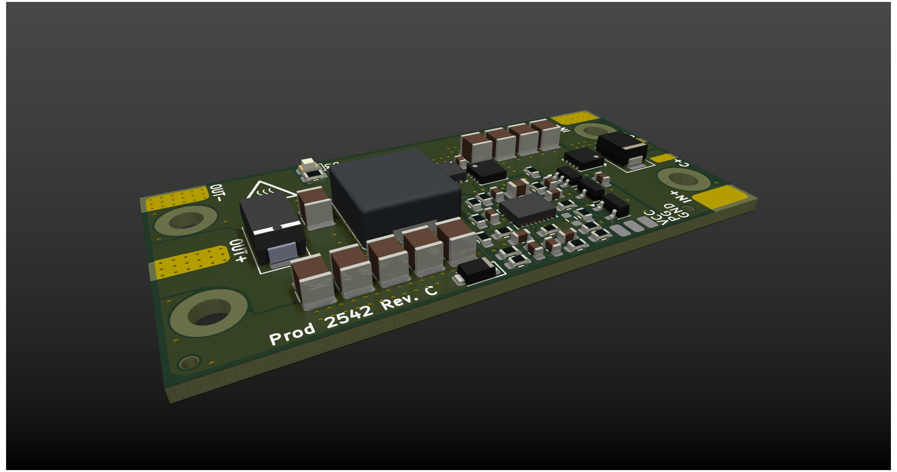
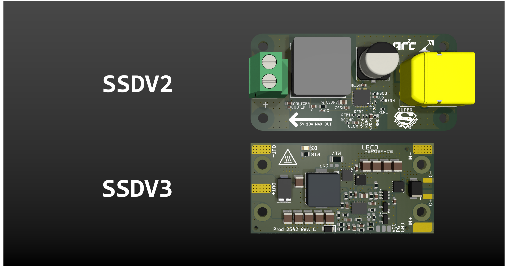

# The Super Step Down V3

The SSDV3 is a non-isolated DC/DC converter module designed for unmanned aerial systems (UAS). The module is intended for converting 50V battery input down to 5-12V output at a maximum load of 8A. It acts as a reliable battery-eliminator circuit (BEC) through effective regulation in the presence of voltage transients caused by high-power brushless motors.

The SSDV3 was independently started by Julian Joaquin as an open-source hardware project, and has been adapted by the UBCO Aerospace Club for its own use in collaboration with Julian.

*We are working on producing the documentation.*

## Specifications

<table><tbody>
  <tr>
    <td>Input Voltage</td>
    <td>20-60V</td>
  </tr>
  <tr>
    <td>Max Transient Voltage</td>
    <td>100V (clamping starts at 70V)</td>
  </tr>
  <tr>
    <td>Output Voltage(s)</td>
    <td>5.1V, 7.4V, 9.6V, 12V</td>
  </tr>
  <tr>
    <td>Thermal Max Output Current</td>
    <td>5A</td>
  </tr>
  <tr>
    <td>Designed Max Output Current</td>
    <td>8A</td>
  </tr>
  <tr>
    <td>Lowest Typical Efficiency</td>
    <td>89%</td>
  </tr>
  <tr>
    <td>Est. Voltage Overshoot</td>
    <td>200mV</td>
  </tr>
</tbody>
</table>

*Specifications are from design, not tested.*

## Comparison with Last Super Step Down

This design is motivated by the challenges encountered with the Jellyfish quadcopter when powering auxiliary electronics off the drone's main battery. Lessons were learned through a variety of integration failures, investigations, and validation testing, and these experiences informed the development of version 3 of the Super Step Down series.

**Improvements from the previous version:**

- Dramatically improved regulation during line transients
- Considerable footprint area reduction by 16.5%
- Configurable output voltages instead of a fixed 5V output
- Added ESD protection on inputs
- Reverse polarity protection for the majority of the circuit
- Lower losses by using direct wire solder pads instead of terminal block

## Important Notice

Copyright &#169; Julian Joaquin 2025

Documentation and media are licensed under CC BY-SA 4.0

Hardware source material licensed under CERN-OHL-W version 2

UBCO is a registered trademark of the University of British Columbia. For guidelines on the permitted uses of UBC trademarks, please see http://universitycounsel.ubc.ca/university-trade-marks/.
